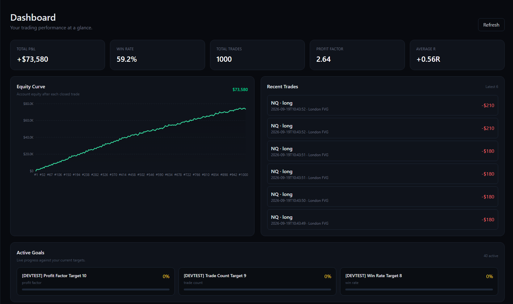
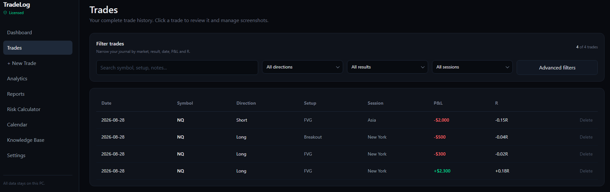
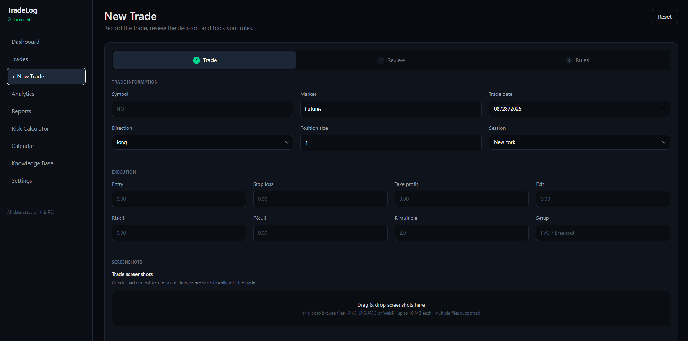
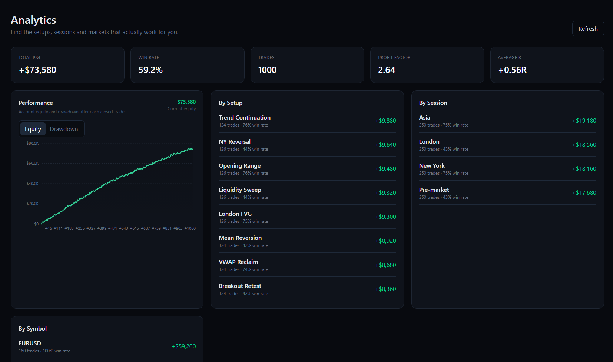
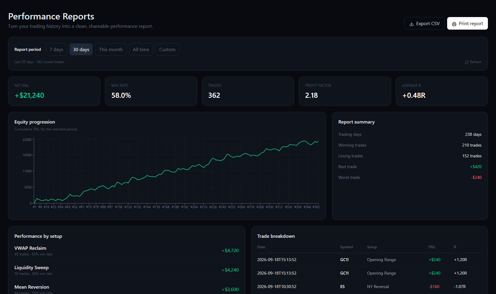
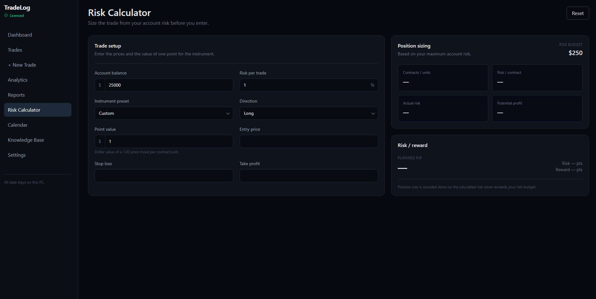
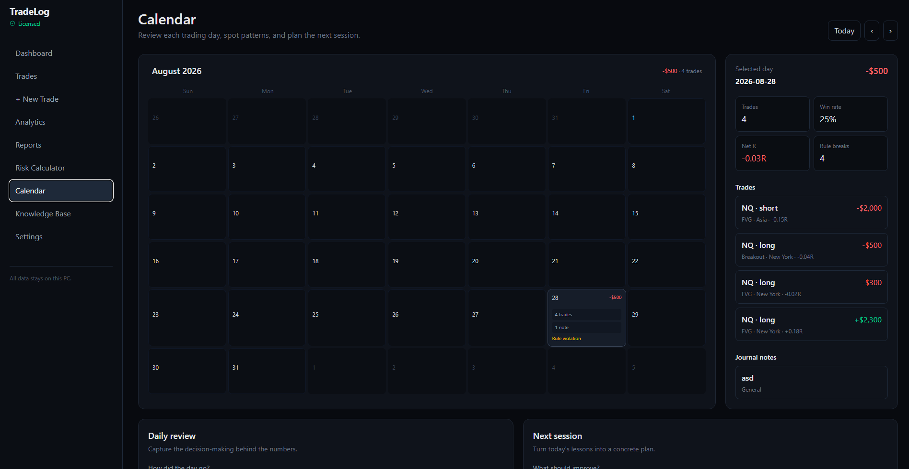
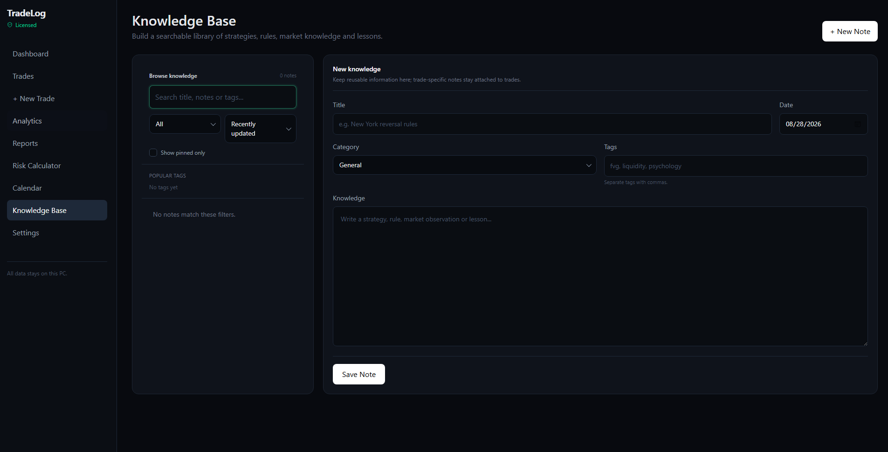

# TradeLog

**A free, local-first trading journal and performance tracking application for Windows.**

TradeLog is designed to help traders record, review, and analyze their trading performance in one place. It keeps your trading data stored locally on your own computer, with no cloud account or online database required.

---

## Features

- 📊 **Dashboard** — View your overall trading performance and key statistics.
- 📈 **Analytics** — Analyze performance by setups, sessions, and symbols.
- 📅 **Trading Calendar** — Review your trading activity and performance by date.
- 📝 **Trading Journal** — Document trades, thoughts, observations, and lessons.
- 💹 **Trade Management** — Record and manage your individual trades.
- 📥 **TradingView Import** — Import trade history directly from TradingView CSV exports.
- 🎯 **Confidence Tracking** — Record your confidence level for each trade from 1–10.
- 💰 **P&L Tracking** — Track profit and loss across your trades.
- 📐 **R-Multiple Tracking** — Record and analyze R-multiple performance.
- 📷 **Screenshot Support** — Attach screenshots to trades for visual review.
- 📋 **Trade History** — Easily review previously recorded trades.
- 🔒 **Local-First** — Your trading data stays on your computer.
- ⚡ **Windows Desktop App** — Built as a dedicated desktop application for Windows.

---

## Privacy

TradeLog is built with a **local-first approach**.

Your trading data is stored locally on your computer using a local database. TradeLog does not require a cloud account or hosted database to use the application.

**Your trading data stays on your computer and remains under your control.**

---

## Getting Started

### Requirements

- Windows 10 or newer
- x64 processor

### Installation

The easiest way to get started with TradeLog is to use the pre-built Windows installer.

1. Go to the **[Releases](../../releases)** page.
2. Download the latest `TradeLog-Setup.exe`.
3. Run the installer.
4. Follow the installation instructions.
5. Launch TradeLog.
6. Start recording and analyzing your trades.

No additional setup or development tools are required when using the pre-built installer.

---

## Importing Trade History

TradeLog supports importing trade history from multiple trading platforms.

### TradingView

TradeLog supports importing trade history using **TradingView CSV exports**.

1. Export your trade history from TradingView.
2. Open TradeLog.
3. Navigate to the import functionality.
4. Select your TradingView CSV file.
5. Review the import preview.
6. Import the trades into your TradeLog database.

### MetaTrader 4 & MetaTrader 5

TradeLog also supports importing trade history from **MetaTrader 4 (MT4)** and **MetaTrader 5 (MT5)** account statement files.

1. Export your account history from MetaTrader.
2. Open TradeLog.
3. Navigate to the import functionality.
4. Select your exported MetaTrader statement.
5. Review the import preview.
6. Import the trades into your TradeLog database.

Supported import formats may vary depending on the export format provided by the trading platform.
---

## Screenshots

### Dashboard

### Trades

### New Trade

### Analytics

### Performance Reports

### Risk Calculator

### Calendar

### Knowledge Base

---

## Roadmap

TradeLog is being developed with the goal of becoming a comprehensive trading performance platform.

Planned improvements may include:

- More detailed performance analytics
- Additional journal functionality
- Expanded trade statistics
- Improved reporting
- Additional import options
- UI and performance improvements
- Further quality-of-life improvements

The roadmap may change as development continues.

---

## Releases

### v1.0.0

The initial stable Windows release of TradeLog.

See the **[Releases](../../releases)** page for downloads, installers, and release notes.

---

## Bug Reports & Feature Requests

If you encounter a bug or have an idea for improving TradeLog, please open an issue in the GitHub repository.

When reporting a bug, please include:

- What happened
- What you expected to happen
- Steps to reproduce the issue
- Any relevant screenshots or error messages

---

## License

TradeLog is distributed under the **TradeLog Software License**.

TradeLog is provided free of charge for personal and non-commercial use. Redistribution, repackaging, modification, commercial use, and use of the TradeLog name and branding are subject to the terms of the license.

See the [`LICENSE`](LICENSE) file for the complete terms.

---

## Disclaimer

TradeLog is a trading journaling and performance tracking tool.

It does not provide financial advice, trading signals, investment recommendations, or guarantees of trading performance.

Always make your own trading and investment decisions.

---

**TradeLog — Track. Review. Improve.**
